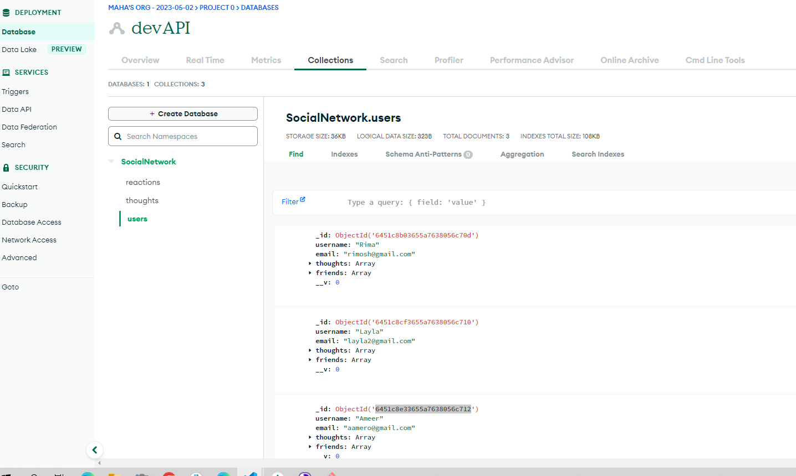
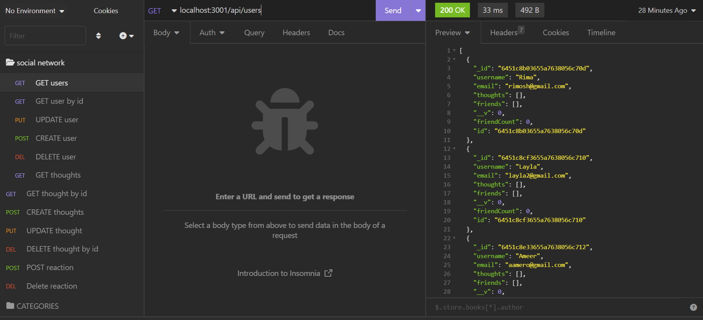

# Social-Network-API 

## Walkthrough Video

 [Click here to visit the Video of Walkthrough for Demonstration]()!

 ## Description
API for a social network web application where users can share their thoughts, react to friends’ thoughts, and create a friend list.

## Install
Make sure MongoDb is installed on your machine.
Download and clone the repository to your machine
In the CLI, enter these commands below
- npm i to install dependencies
- npm start to begin the appication

## Usage
- Node.js
- Express.js
- MongoDB
- Mongoose ODM